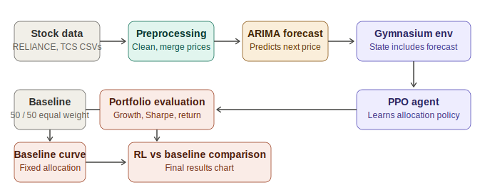
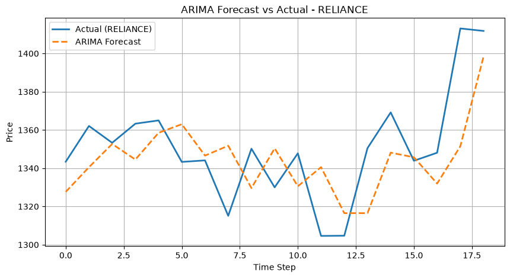
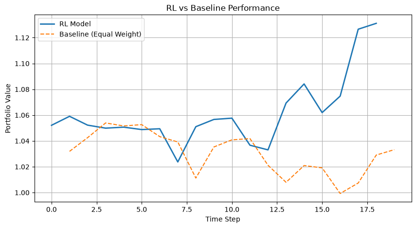
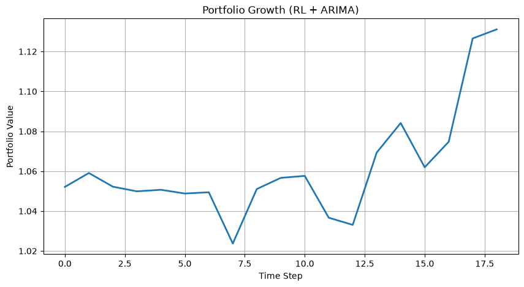

<div align="center">

# RL-Based Portfolio Optimization using PPO and ARIMA

Reinforcement learning meets time-series forecasting for dynamic stock portfolio allocation.


</div>

---

## Table of contents

- [Overview](#overview)
- [Problem statement](#problem-statement)
- [Architecture](#architecture)
- [Tech stack](#tech-stack)
- [Folder structure](#folder-structure)
- [Dataset](#dataset)
- [Methodology](#methodology)
- [Results](#results)
- [Limitations](#limitations)
- [Future scope](#future-scope)
- [Installation](#installation)
- [Usage](#usage)
- [Requirements](#requirements)
- [Contributors](#contributors)
- [References](#references)
- [License](#license)

---

## Overview

This project presents a reinforcement learning approach for portfolio optimization, combining **Proximal Policy Optimization (PPO)** with **ARIMA** time-series forecasting.

The goal is to dynamically allocate investments between two stocks — **Reliance Industries** and **Tata Consultancy Services (TCS)** — using historical market data and ARIMA-predicted price information as input to a reinforcement learning agent.

ARIMA generates a predictive price feature, which is fed into a custom Gymnasium environment. A PPO agent then learns an allocation policy by interacting with this environment, and its performance is benchmarked against a simple equal-weight baseline portfolio.

In short: **ARIMA predicts, and PPO decides.**

## Problem statement

Traditional portfolio allocation strategies typically rely on fixed rules and don't adapt well to changing market conditions.

This project explores whether a PPO-based reinforcement learning agent, enhanced with ARIMA-generated predictive features, can outperform a static equal-weight allocation strategy — and by how much.

## Architecture

The pipeline below shows how data flows from raw stock prices through forecasting, the RL environment, and finally into a head-to-head comparison with the baseline.



## Tech stack

| Category | Tools |
|---|---|
| Language | Python 3.12 |
| Data handling | Pandas, NumPy |
| Visualization | Matplotlib |
| RL framework | Gymnasium, Stable-Baselines3 (PPO) |
| Forecasting | Statsmodels (ARIMA) |
| Environment | Jupyter Notebook |
| Version control | Git, GitHub |

## Folder structure

```
RL-Portfolio-Optimization/
├── images/
│   ├── architecture.svg
│   ├── portfolio_growth_rl.png
│   ├── rl_vs_baseline.png
│   └── arima_forecast_vs_actual.png
├── RL_Portfolio_Optimization.ipynb
├── Quote-Equity-RELIANCE-EQ-24-03-2026-24-04-2026.csv
├── Quote-Equity-TCS-EQ-24-03-2026-24-04-2026.csv
├── RL Design Document.pptx
├── RL ppt.pptx
├── requirements.txt
├── LICENSE
├── .gitignore
└── README.md
```

## Dataset

The project uses historical daily price data for Reliance Industries and TCS, covering the period 24-Mar-2026 to 24-Apr-2026.

| Column | Description |
|---|---|
| DATE | Trading date |
| OPEN | Opening price |
| HIGH | Highest price of the day |
| LOW | Lowest price of the day |
| CLOSE | Closing price (used for modeling) |
| VWAP | Volume-weighted average price |
| VOLUME | Shares traded |

Only the `CLOSE` price is used for modeling — it's cleaned, converted to numeric, and merged into a single working dataset indexed by trading day.

## Methodology

1. **Data collection** — Historical CLOSE prices for both stocks are loaded from CSV.
2. **Preprocessing** — Values are cleaned, converted to numeric, and missing data is handled.
3. **ARIMA forecasting** — An ARIMA(3,1,0) model is fit on Reliance's price series and generates a one-step-ahead predicted price (`REL_PRED`), which becomes part of the RL state.

   

4. **Custom RL environment** — A Gymnasium environment models the portfolio, where:
   - **State**: current prices + ARIMA-predicted price
   - **Action**: portfolio allocation weights
   - **Reward**: portfolio return
5. **PPO training** — A PPO agent (Stable-Baselines3) learns an allocation policy through repeated interaction with the environment.
6. **Baseline comparison** — A static 50/50 equal-weight portfolio serves as the benchmark for evaluating whether the learned policy adds value.

## Results





| Metric | RL (PPO + ARIMA) | Baseline (equal-weight) |
|---|---|---|
| Sharpe ratio | 0.295 | 0.123 |
| Annualized return | 291% | 54% |

> **Note:** the annualized return figures are extrapolated from a short ~19-day evaluation window, which amplifies short-term movement considerably. These numbers should be read directionally — the RL agent outperforms the baseline over the tested period — rather than as production-scale return expectations. A longer backtest window would be needed before drawing stronger conclusions.

## Limitations

- Uses a limited historical dataset (~1 month of daily prices)
- Only two stocks are considered
- Transaction costs and slippage are not modeled
- No real-time market data integration
- Historical performance does not guarantee future results

## Future scope

- Expand to larger historical datasets and longer backtest windows
- Add more stocks and asset classes
- Model transaction costs and slippage
- Introduce explicit risk constraints
- Compare ARIMA against LSTM or Transformer-based forecasting
- Perform hyperparameter optimization
- Implement proper train/validation/test splits
- Integrate real-time market data
- Build a portfolio management dashboard

## Installation

```bash
# Clone the repository
git clone https://github.com/Rahulskashyap/RL-Portfolio-Optimization.git
cd RL-Portfolio-Optimization

# Create and activate a virtual environment
python -m venv .venv
.venv\Scripts\activate      # Windows
source .venv/bin/activate   # macOS / Linux

# Install dependencies
pip install -r requirements.txt
```

## Usage

1. Open `RL_Portfolio_Optimization.ipynb` in Jupyter or VS Code.
2. Ensure the two CSV files are in the same folder as the notebook.
3. Run all cells top to bottom (Kernel → Restart and Run All).
4. Generated charts will be saved automatically to the project folder.

## Requirements

See [`requirements.txt`](requirements.txt) for the full list of dependencies:

```
pandas
numpy
matplotlib
gymnasium
stable-baselines3
statsmodels
```

## Contributors

| Name | GitHub |
|---|---|
| Rahul Kashyap | [@Rahulskashyap](https://github.com/Rahulskashyap) |
| Tharun C | [@Tharunnxx](https://github.com/Tharunnxx) |

## References

- [Proximal Policy Optimization (Schulman et al., 2017)](https://arxiv.org/abs/1707.06347)
- [Stable-Baselines3 documentation](https://stable-baselines3.readthedocs.io/)
- [Gymnasium documentation](https://gymnasium.farama.org/)
- [Statsmodels ARIMA documentation](https://www.statsmodels.org/stable/generated/statsmodels.tsa.arima.model.ARIMA.html)

## License

This project is licensed under the [MIT License](LICENSE).
